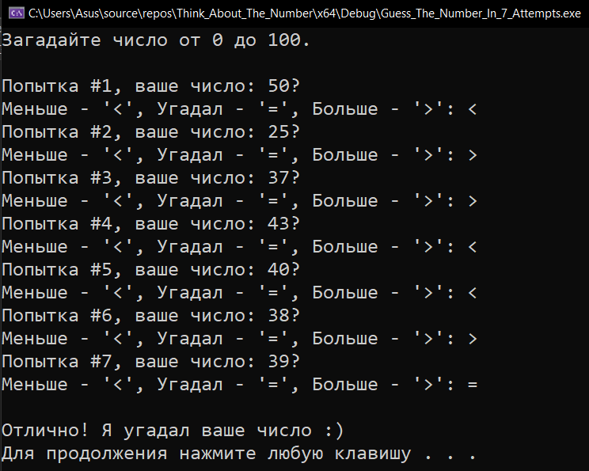

# Think_About_The_Number

<a href="https://gist.github.com/SlavikArt/2809ffa21a27c9022f496ea2715a0708">Gist - страница со всеми кодами проектов</a>

* [Guess_The_Number_In_7_Attempts](Guess_The_Number_In_7_Attempts)

    <h2>Guess the number in 7 attempts</h2>
    
Алгоритм, который угадает ваше число от 0 до 100 за <= 7 попыток.

    

